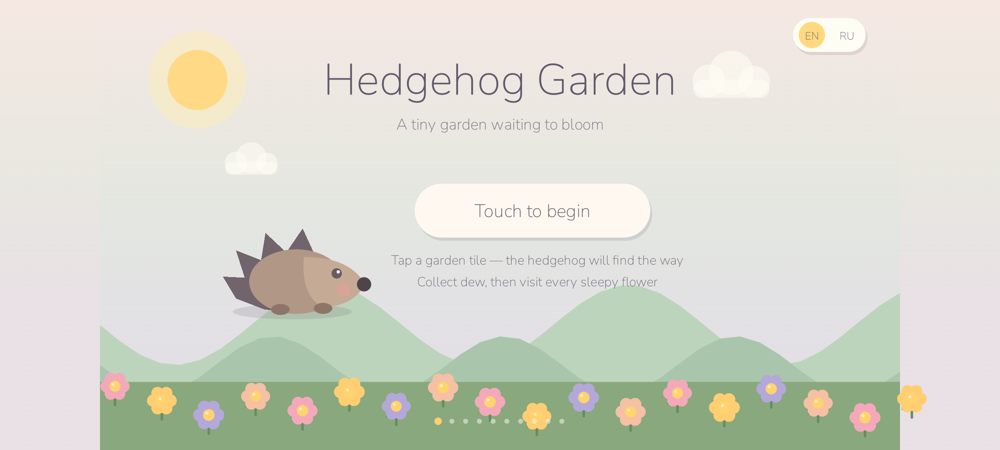
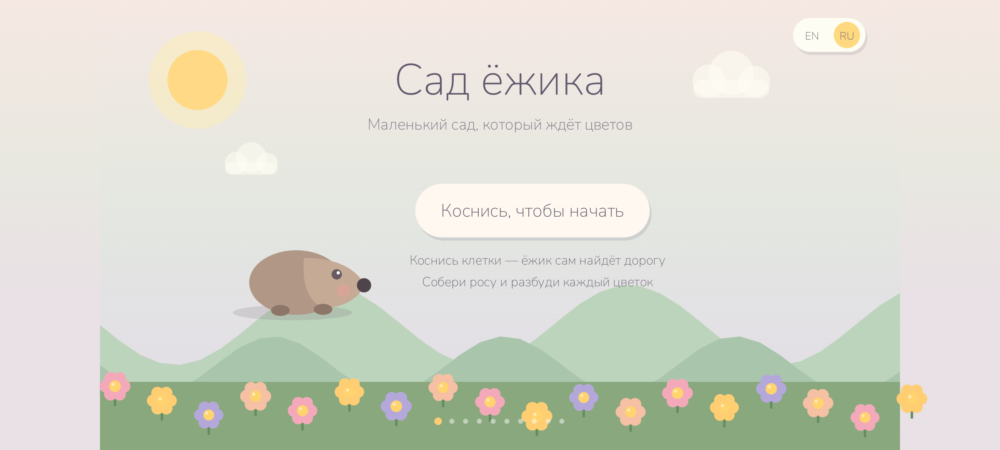
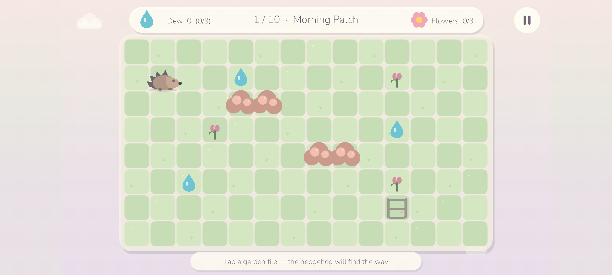
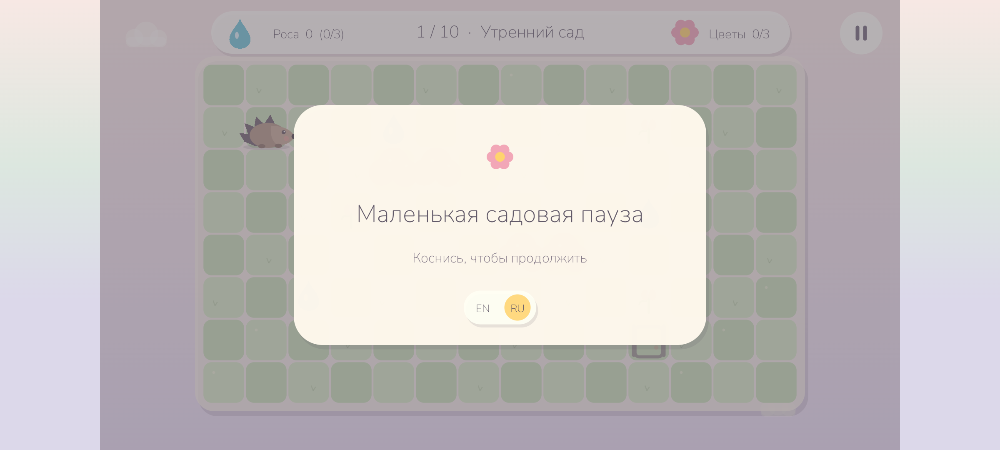

# Hedgehog Garden

**Author:** `cocomelonc`  
**Copyright:** © 2026 cocomelonc (Zhassulan Zhussupov)

Hedgehog Garden is a calm, one-finger Android tilemap game made for children.
Guide a tiny hedgehog through ten handcrafted gardens, collect drops of dew,
wake every sleepy flower, and reach the garden gate. There are no ads,
accounts, purchases, trackers, network calls, timers, lives, or game-over
screens.

The game starts in English and includes an in-game `EN / RU` language switch.
Both Latin and Cyrillic use the same bundled Nunito typeface, so typography is
consistent on every Android device.

| English | Русский |
|---|---|
|  |  |



The pause card uses a wide safe area, 72 logical pixels of horizontal content
padding, and a smooth fade-and-scale entrance. Longer Russian text is measured
and fitted inside the same margins.



## Gameplay

- Tap any reachable tile; the hedgehog finds a shortest safe route.
- Bushes, water, and rocks block movement; bridges connect paths.
- Pick up dew, then visit a sleepy flower to make it bloom.
- Bloom all three flowers and walk to the glowing gate.
- Progress is saved locally. There is no failure state or pressure.

## Ten gardens

- **Morning Patch** - a welcoming first garden with two small hedges.
- **Clover Lane** - a long hedge teaches route planning.
- **Lily Brook** - the first stream and a narrow bridge.
- **Rose Corner** - flowers tucked around a rose hedge.
- **Pebble Garden** - soft stone clusters create gentle detours.
- **Bluebell Bend** - two bridge crossings through blue water.
- **Mint Maze** - a readable, compact hedge maze.
- **Peach Grove** - orchard-like rows in warm peach colors.
- **Moon Garden** - lily pools and a quiet evening palette.
- **Golden Meadow** - a final garden combining hedges, water, and bridges.

Every level is a real 14×8 tilemap validated by automated reachability tests.
The tests prove that the start, every dew drop, every flower, and the gate are
connected, and they complete all ten levels through the same game rules used by
the app.

## Why it is deliberately small

- Native Java and Android Canvas; no game engine and no runtime dependencies.
- Original procedural vector-like artwork that stays sharp at every density.
- Procedural chimes; no bundled audio or codec dependency.
- One activity, one custom view, and a pure-Java gameplay core.
- Local progress only, stored in private `SharedPreferences`.
- English and Russian resources bundled in every APK and AAB.
- No native `.so` libraries and no Internet or advertising permission.

## Android configuration

| Setting | Value |
|---|---:|
| Application ID | `com.cocomelonc.hedgehoggarden` |
| Minimum SDK | 26 (Android 8.0) |
| Target SDK | 36 (Android 16) |
| Compile SDK | 36 |
| Java | 17 |
| Android Gradle Plugin | 8.9.1 |
| Gradle | 8.11.1 |

Android 15 is API 35, which lies inside the declared compatibility range
`26..36`; Android 16/API 36 is the target and compile platform. The app has no
native ELF libraries, so project code is unaffected by native 16 KB memory-page
compatibility requirements. The verification script rejects any unexpected
`.so` file and confirms the SDK declarations from the final APK.

The debug APK was also clean-installed and exercised on a Pixel 7 emulator
running Android 16/API 36. The runtime check covered launch, landscape scaling,
shortest-path movement, dew collection, flower blooming, pause, Android Back,
the `EN / RU` switch, and Cyrillic rendering. The screenshots above come from
that build, not from a design mock-up.

## Build

Install JDK 17 and Android SDK Platform 36, then run:

```bash
export ANDROID_HOME="$HOME/Android/Sdk"
export JAVA_HOME=/path/to/jdk-17
./gradlew testDebugUnitTest lintDebug assembleDebug
```

The debug APK is written to:

```text
app/build/outputs/apk/debug/app-debug.apk
```

For an Android App Bundle artifact:

```bash
./gradlew bundleRelease
```

The release AAB is unsigned. Configure an upload key outside the repository;
never commit a keystore or its passwords.

## Verification

```bash
./scripts/verify_android.sh
```

It runs unit tests and strict Android Lint, builds the APK, verifies its debug
signature and ZIP alignment, confirms `minSdk=26` / `targetSdk=36`, and rejects
network/ad permissions and native libraries.

## Controls

- Tap a garden tile: walk there along a safe shortest route.
- Top-right pause button or Android Back: pause.
- `EN / RU`: switch language on the title or pause screen.
- Android Back from pause: return to the title screen.

## Project layout

```text
app/src/main/java/com/cocomelonc/hedgehoggarden/
  MainActivity.java          edge-to-edge Android host and lifecycle
  HedgehogGardenView.java    procedural drawing, touch input, particles, UI
  GardenWorld.java           testable movement and objective rules
  GardenLevel.java           ten immutable 14×8 tilemaps and palettes
  AudioEngine.java           tiny procedural chime synthesizer
app/src/test/                full-journey and level reachability tests
art/                         procedural-art licensing notes
third_party/nunito/          exact SIL OFL license for the bundled font
scripts/                     reproducible Android verification
```

## Privacy and children

The app is intentionally offline and does not collect or transmit data. See
[PRIVACY.md](PRIVACY.md). A fork that adds analytics, advertising, accounts, or
network services must update its privacy declarations and store disclosures.

## License

Project source and original procedural artwork are available under the MIT
License. Nunito remains under the SIL Open Font License 1.1; see
[`third_party/nunito/OFL.txt`](third_party/nunito/OFL.txt).

Hedgehog Garden was created by **cocomelonc**. The author and copyright notices
must remain in copies and substantial portions of the project as required by
the MIT License. See [AUTHORS.md](AUTHORS.md) and [LICENSE](LICENSE).

Contributions are welcome; please read [CONTRIBUTING.md](CONTRIBUTING.md).
